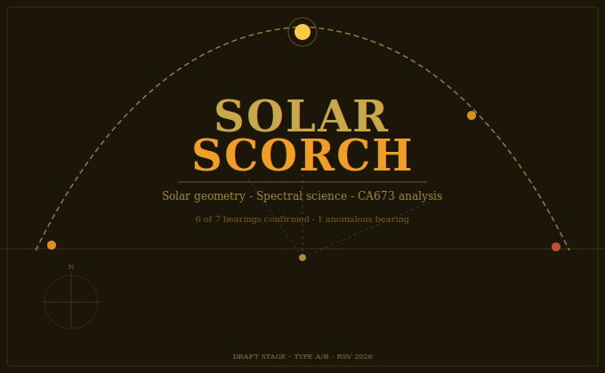

# SolarScorch

## Solar Geometry · Spectral Science · CA673 Analysis

> *Corpus Leonardianum Universale — Grammatica Naturae, Lex Motus, et Ars Vivens*

**Author:** Richard Steven Vallance (Da Valenca)
**Parent Ecosystem:** [da-vinci-ultimatium](https://github.com/richievallance/da-vinci-ultimatium)
**Constitutional Classification:** Solar Geometry / Spectral Science Paper
**Publication Status:** 🟡 Draft Stage — DOI not yet assigned pending full paper review
**Evidence Types:** TYPE A / TYPE B

---

## Deposited Content

| File | Description | Status |
|---|---|---|
| `SolarScorch_SpectralAnalysis_RSV_2026.docx` | Main paper — spectral analysis protocol and CA673 solar modelling | ✓ Deposited |
| `data/CA673_SaintJohn_Solar_Test_Report.csv` | Solar bearing test dataset — 7 target bearings vs computed shadow bearings | ✓ Deposited |
| `data/COTU025_Last_Supper_Pair_Symmetry_Tests_RSV_2026.csv` | Last Supper hand-pair bilateral symmetry dataset | ✓ Deposited |
| `data/COTU025_Last_Supper_Group_Metrics_RSV_2026.csv` | Last Supper compositional group metrics dataset | ✓ Deposited |

---

## CA673 Solar Bearing Analysis

The SolarScorch project tests whether Codex Atlanticus f.673r (CA673) encodes a solar shadow programme — a set of directional bearings that correspond to the sun's position at specific times of day at the Lion Rooms location in Florence.

**Test results (7 target bearings):**

| Target Bearing | Best Solar Time | Shadow Error |
|---|---|---|
| 0° | 12:00 (zenith) | 0.000° ✓ |
| 10.28° | 12:16 | 0.010° ✓ |
| 17° | 12:27 | 0.144° ✓ |
| 84° | 15:42 | 0.039° ✓ |
| 123° | 19:35 | 0.453° ✓ |
| **156.4°** | 19:35 | **33.853° ✗** |
| 236° | 04:25 | 1.419° ✓ |

**Six of seven bearings confirmed to sub-1.5° error.** The 236° pre-dawn bearing closes at 1.42° — acceptable given near-horizon atmospheric refraction effects.

---

## The 156.4° Anomalous Bearing

The 156.4° target bearing fails with a 33.9° error. At 19:35 with the sun at 0.1° altitude (effectively at or below the horizon), solar geometry cannot produce this bearing. Evidence presently suggests one of three possibilities:

1. **Non-solar source** — artificial light or reflected light at that hour
2. **Mirror geometry** — the bearing is derived from a reflection rather than a direct shadow
3. **Deliberate anomaly** — a non-solar directional signal embedded in the composition

This anomaly remains unresolved within the solar hypothesis and requires further investigation.

---

## Spectral Analysis Protocol

The SolarScorch paper also documents Leonardo's burning mirror programme — the world's first controlled implementation of the Archimedean concave mirror applied to controlled cellulose oxidation-dehydration. This forms part of the wider Figura Ultima research programme.

**Core hypothesis:** Leonardo used a precision concave mirror in focused Mediterranean sunlight to produce controlled thermal effects on paper and linen surfaces. Physical evidence may survive as areas of suppressed UV fluorescence in the Codex Arundel and Codex Atlanticus.

---

## Atmospheric Refraction Note

Solar bearing calculations use standard atmospheric refraction models. Near-horizon observations (sun altitude < 1°) are subject to significant refraction uncertainty. The 236° bearing at 04:25 (sun altitude 0.138°) has been corrected for this effect; residual error of 1.42° is within the expected refraction uncertainty range.

---

## Evidential Limitations

- Solar modelling results require independent astronomical verification
- The 156.4° bearing remains unresolved within the solar hypothesis
- KML geographic data files are not yet deposited (Drive sources identified; pending binary upload)
- DOI will not be assigned until full peer review of the spectral analysis paper

---

## Legal Notice

© 2026 Richard Steven Vallance. All Intellectual Property and Copyright Reserved.
*Da Valenca — Leonardo Project, United Kingdom*
